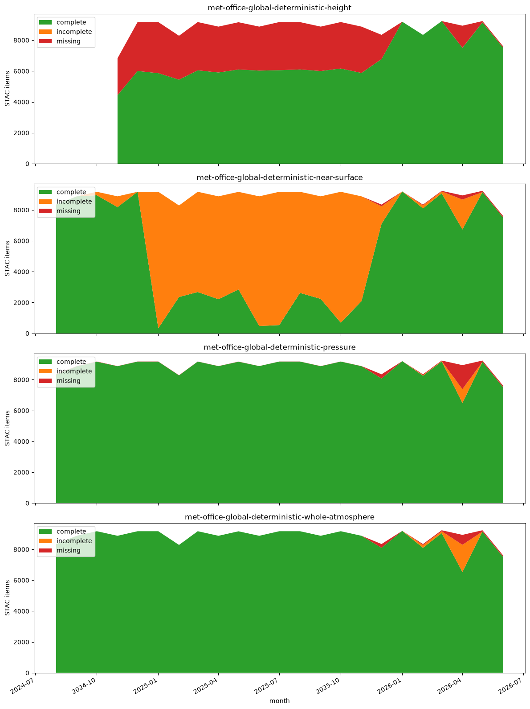

# Microsoft Planetary Computer Met Office check


```python
import duckdb

con = duckdb.connect()
con.sql("DESCRIBE SELECT * FROM 'output/checks.parquet'")
```


    ┌────────────────────┬─────────────┬─────────┬─────────┬─────────┬─────────┐
    │    column_name     │ column_type │  null   │   key   │ default │  extra  │
    │      varchar       │   varchar   │ varchar │ varchar │ varchar │ varchar │
    ├────────────────────┼─────────────┼─────────┼─────────┼─────────┼─────────┤
    │ collection         │ VARCHAR     │ YES     │ NULL    │ NULL    │ NULL    │
    │ item               │ VARCHAR     │ YES     │ NULL    │ NULL    │ NULL    │
    │ reference_datetime │ TIMESTAMP   │ YES     │ NULL    │ NULL    │ NULL    │
    │ has_item           │ BOOLEAN     │ YES     │ NULL    │ NULL    │ NULL    │
    │ num_missing        │ BIGINT      │ YES     │ NULL    │ NULL    │ NULL    │
    └────────────────────┴─────────────┴─────────┴─────────┴─────────┴─────────┘


```python
con.sql("DESCRIBE SELECT * FROM 'output/paths.parquet'")
```


    ┌────────────────────┬─────────────┬─────────┬─────────┬─────────┬─────────┐
    │    column_name     │ column_type │  null   │   key   │ default │  extra  │
    │      varchar       │   varchar   │ varchar │ varchar │ varchar │ varchar │
    ├────────────────────┼─────────────┼─────────┼─────────┼─────────┼─────────┤
    │ model              │ VARCHAR     │ YES     │ NULL    │ NULL    │ NULL    │
    │ reference_datetime │ TIMESTAMP   │ YES     │ NULL    │ NULL    │ NULL    │
    │ path               │ VARCHAR     │ YES     │ NULL    │ NULL    │ NULL    │
    │ collection         │ VARCHAR     │ YES     │ NULL    │ NULL    │ NULL    │
    │ item               │ VARCHAR     │ YES     │ NULL    │ NULL    │ NULL    │
    └────────────────────┴─────────────┴─────────┴─────────┴─────────┴─────────┘


```python
monthly = con.sql("""
    SELECT
        collection,
        date_trunc('month', reference_datetime) AS month,
        SUM(CASE WHEN NOT has_item THEN 1 ELSE 0 END) AS missing,
        SUM(CASE WHEN has_item AND num_missing > 0 THEN 1 ELSE 0 END) AS incomplete,
        SUM(CASE WHEN has_item AND num_missing = 0 THEN 1 ELSE 0 END) AS complete
    FROM 'output/checks.parquet'
    GROUP BY collection, month
    ORDER BY collection, month
""").df()
monthly
```


<div>
<style scoped>
    .dataframe tbody tr th:only-of-type {
        vertical-align: middle;
    }

    .dataframe tbody tr th {
        vertical-align: top;
    }

    .dataframe thead th {
        text-align: right;
    }
</style>
<table border="1" class="dataframe">
  <thead>
    <tr style="text-align: right;">
      <th></th>
      <th>collection</th>
      <th>month</th>
      <th>missing</th>
      <th>incomplete</th>
      <th>complete</th>
    </tr>
  </thead>
  <tbody>
    <tr>
      <th>0</th>
      <td>met-office-global-deterministic-height</td>
      <td>2024-11-01</td>
      <td>2389.0</td>
      <td>0.0</td>
      <td>4441.0</td>
    </tr>
    <tr>
      <th>1</th>
      <td>met-office-global-deterministic-height</td>
      <td>2024-12-01</td>
      <td>3171.0</td>
      <td>0.0</td>
      <td>6005.0</td>
    </tr>
    <tr>
      <th>2</th>
      <td>met-office-global-deterministic-height</td>
      <td>2025-01-01</td>
      <td>3312.0</td>
      <td>0.0</td>
      <td>5864.0</td>
    </tr>
    <tr>
      <th>3</th>
      <td>met-office-global-deterministic-height</td>
      <td>2025-02-01</td>
      <td>2844.0</td>
      <td>0.0</td>
      <td>5444.0</td>
    </tr>
    <tr>
      <th>4</th>
      <td>met-office-global-deterministic-height</td>
      <td>2025-03-01</td>
      <td>3128.0</td>
      <td>0.0</td>
      <td>6048.0</td>
    </tr>
    <tr>
      <th>...</th>
      <td>...</td>
      <td>...</td>
      <td>...</td>
      <td>...</td>
      <td>...</td>
    </tr>
    <tr>
      <th>84</th>
      <td>met-office-global-deterministic-whole-atmosphere</td>
      <td>2026-02-01</td>
      <td>64.0</td>
      <td>180.0</td>
      <td>8100.0</td>
    </tr>
    <tr>
      <th>85</th>
      <td>met-office-global-deterministic-whole-atmosphere</td>
      <td>2026-03-01</td>
      <td>65.0</td>
      <td>126.0</td>
      <td>9047.0</td>
    </tr>
    <tr>
      <th>86</th>
      <td>met-office-global-deterministic-whole-atmosphere</td>
      <td>2026-04-01</td>
      <td>643.0</td>
      <td>1764.0</td>
      <td>6533.0</td>
    </tr>
    <tr>
      <th>87</th>
      <td>met-office-global-deterministic-whole-atmosphere</td>
      <td>2026-05-01</td>
      <td>85.0</td>
      <td>0.0</td>
      <td>9153.0</td>
    </tr>
    <tr>
      <th>88</th>
      <td>met-office-global-deterministic-whole-atmosphere</td>
      <td>2026-06-01</td>
      <td>91.0</td>
      <td>3.0</td>
      <td>7505.0</td>
    </tr>
  </tbody>
</table>
<p>89 rows × 5 columns</p>
</div>


```python
import matplotlib.pyplot as plt

collections = sorted(monthly["collection"].unique())
fig, axes = plt.subplots(len(collections), 1, figsize=(12, 4 * len(collections)), sharex=True)

for ax, collection in zip(axes, collections):
    data = monthly[monthly["collection"] == collection].set_index("month")
    ax.stackplot(
        data.index,
        data["complete"],
        data["incomplete"],
        data["missing"],
        labels=["complete", "incomplete", "missing"],
        colors=["#2ca02c", "#ff7f0e", "#d62728"],
    )
    ax.set_ylabel("STAC items")
    ax.set_title(collection)
    ax.legend(loc="upper left")

axes[-1].set_xlabel("month")
fig.autofmt_xdate()
plt.tight_layout()
plt.show()
```


    

    


```python
con.sql(r"""
    SELECT
        collection,
        regexp_extract(path, '\d+T\d+Z-PT\d+H\d+M-(.+)\.nc$', 1) AS variable,
        COUNT(*) AS missing
    FROM 'output/paths.parquet'
    GROUP BY collection, variable
    ORDER BY collection, missing DESC
""").df()
```


<div>
<style scoped>
    .dataframe tbody tr th:only-of-type {
        vertical-align: middle;
    }

    .dataframe tbody tr th {
        vertical-align: top;
    }

    .dataframe thead th {
        text-align: right;
    }
</style>
<table border="1" class="dataframe">
  <thead>
    <tr style="text-align: right;">
      <th></th>
      <th>collection</th>
      <th>variable</th>
      <th>missing</th>
    </tr>
  </thead>
  <tbody>
    <tr>
      <th>0</th>
      <td>met-office-global-deterministic-height</td>
      <td>cloud_amount_on_height_levels</td>
      <td>41982</td>
    </tr>
    <tr>
      <th>1</th>
      <td>met-office-global-deterministic-near-surface</td>
      <td>fog_fraction_at_screen_level</td>
      <td>27552</td>
    </tr>
    <tr>
      <th>2</th>
      <td>met-office-global-deterministic-near-surface</td>
      <td>wind_direction_at_10m</td>
      <td>27496</td>
    </tr>
    <tr>
      <th>3</th>
      <td>met-office-global-deterministic-near-surface</td>
      <td>wind_gust_at_10m</td>
      <td>27471</td>
    </tr>
    <tr>
      <th>4</th>
      <td>met-office-global-deterministic-near-surface</td>
      <td>snowfall_rate</td>
      <td>27442</td>
    </tr>
    <tr>
      <th>...</th>
      <td>...</td>
      <td>...</td>
      <td>...</td>
    </tr>
    <tr>
      <th>66</th>
      <td>met-office-global-deterministic-whole-atmosphere</td>
      <td>cloud_amount_of_medium_cloud</td>
      <td>2471</td>
    </tr>
    <tr>
      <th>67</th>
      <td>met-office-global-deterministic-whole-atmosphere</td>
      <td>cloud_amount_of_low_cloud</td>
      <td>2470</td>
    </tr>
    <tr>
      <th>68</th>
      <td>met-office-global-deterministic-whole-atmosphere</td>
      <td>cloud_amount_of_total_cloud</td>
      <td>2468</td>
    </tr>
    <tr>
      <th>69</th>
      <td>met-office-global-deterministic-whole-atmosphere</td>
      <td>cloud_amount_of_total_convective_cloud</td>
      <td>2465</td>
    </tr>
    <tr>
      <th>70</th>
      <td>met-office-global-deterministic-whole-atmosphere</td>
      <td>temperature_at_tropopause</td>
      <td>2459</td>
    </tr>
  </tbody>
</table>
<p>71 rows × 3 columns</p>
</div>


